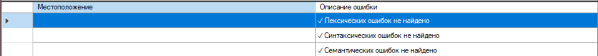
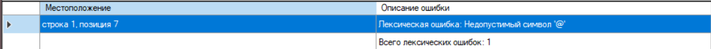
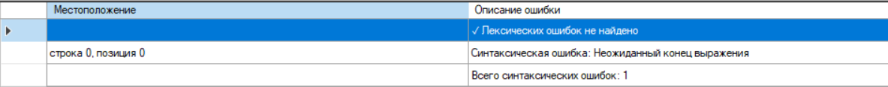
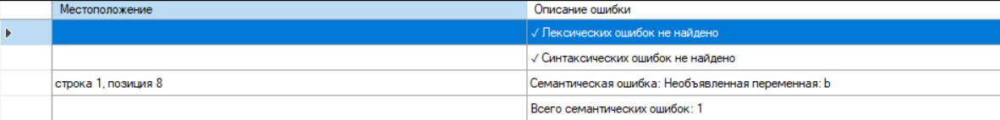

# Лабораторная работа №6 — Создание внутренней формы представления программы
## Цель работы
Изучить методы построения внутреннего представления программы (ВПП) на основе контекстно-свободной грамматики, реализовать синтаксический анализатор методом рекурсивного спуска и преобразовать арифметические выражения в тетрады и ПОЛИЗ.
## Автор
* Сущих Анна Александровна
* Группа: АП-326
## Вариант задания
Язык: Python  
Определение грамматики:
```
E → TA  
A → ε | + TA | - TA  
T → FB  
B  → ε | '*' F B | '/' F B | '//' F B | '%' F B | '**' F B  
F → num | id | (E)  
id → letter {letter | digit | _}  
num → digit {digit}
```
Примеры верных строк:
* 2 + 3 *4
* (3 + 3) * 2
* 3 + 5 
* x = 5
* y = 10
## Диаграмма лексера

## Тестовые примеры работы лексера и парсера
### Строка x = 10 (корректная строка)

### Строка x = 10@ (лексическая ошибка)

### Строка 1 + 1 + (синтаксическая ошибка)

### Строка x = 10 + b (семантическая ошибка)

